# Garri vs Chromium — Kami demo documents

Every fixture in this repository was written by us, to probe one mechanism at
a time. These ten are not: they are the demo documents from
[tw93/Kami](https://github.com/tw93/Kami/tree/main/assets/demos), written by
someone else for their own tool. They are the first test of whether any of
this survives a document we did not design.

For each demo, the same page in the same browser produces two PDFs —
Chromium's own `printToPDF` and Garri's — which are then rasterised at 110 dpi
and compared pixel by pixel. The diff images mark **red where only Chromium
put ink** and **blue where only Garri did**.

Reproduce with `node experiments/kami-compare.js && node experiments/kami-report.js`.

## Summary

| Demo | Chromium | Garri | Pages | Worst diff | …with an embeddable font | Time |
| --- | ---: | ---: | :---: | ---: | ---: | ---: |
| [demo-agent-slides](https://github.com/tw93/Kami/blob/main/assets/demos/demo-agent-slides.html) | 8 | 8 | ✅ | 3.77 % | 0.72 % | 40 ms |
| [demo-changelog](https://github.com/tw93/Kami/blob/main/assets/demos/demo-changelog.html) | 1 | 1 | ✅ | 6.02 % | 0.56 % | 26 ms |
| [demo-kaku](https://github.com/tw93/Kami/blob/main/assets/demos/demo-kaku.html) | 8 | 8 | ✅ | 5.34 % | 4.69 % | 207 ms |
| [demo-kami-print](https://github.com/tw93/Kami/blob/main/assets/demos/demo-kami-print.html) | 1 | 1 | ✅ | 2.06 % | 1.36 % | 143 ms |
| [demo-letter](https://github.com/tw93/Kami/blob/main/assets/demos/demo-letter.html) | 1 | 1 | ✅ | 2.81 % | 2.80 % | 134 ms |
| [demo-mole](https://github.com/tw93/Kami/blob/main/assets/demos/demo-mole.html) | 1 | 1 | ✅ | 4.12 % | 1.32 % | 128 ms |
| [demo-musk-resume](https://github.com/tw93/Kami/blob/main/assets/demos/demo-musk-resume.html) | 2 | 2 | ✅ | 8.01 % | 2.50 % | 40 ms |
| [demo-resume-ko](https://github.com/tw93/Kami/blob/main/assets/demos/demo-resume-ko.html) | 2 | 2 | ✅ | 5.25 % | 5.15 % | 786 ms |
| [demo-tesla](https://github.com/tw93/Kami/blob/main/assets/demos/demo-tesla.html) | 2 | 2 | ✅ | 3.37 % | 2.58 % | 169 ms |
| [demo-waza](https://github.com/tw93/Kami/blob/main/assets/demos/demo-waza.html) | 1 | 1 | ✅ | 5.71 % | 1.46 % | 33 ms |

The last column re-runs each document with **one embeddable font forced on both
sides**. That separates two things the raw number conflates: whether Garri
reproduces the layout the browser produced, and whether it could read the font
at all. Across every page:

| | Worst | Median | Mean |
| --- | ---: | ---: | ---: |
| As authored | 8.01 % | 3.38 % | 3.57 % |
| Embeddable font | 5.15 % | 1.07 % | 1.49 % |

**Forcing an embeddable face removes 58 % of the mean difference.**
That share is font substitution rather than rendering. What is left is the
honest residue: sub-pixel placement, glyph rasterisation, and the handful of
features listed below.

Every page also carries a second figure, the share of pixels differing by more
than **2**/255. The headline threshold is 32/255, which is blind to a large area
that is off by a little — a page rendered on the wrong background colour scores
near zero on it. One did: a page whose background was missing and whose chart was
drawn off the page measured 5.13 % at 32/255 while **99.76 %** of its pixels were
wrong. Across the suite now, the worst page reads 11.50 % at the low
threshold, which is the antialiasing fringe around text and nothing more.

**10 of 10** demos paginate to exactly the same page count as
Chromium. Worst single page difference across all of them: **8.01 %**; median **3.38 %**.

## What this exercise found

Running against documents we did not write surfaced four defects that every
synthetic fixture had missed. Three are fixed; the fourth is inherent.

**Fragmentation was defeated by `max-width`.** Real documents routinely carry
`@media screen { body { max-width: 210mm; padding: 25mm } }`. Garri reads the
*screen* layout, so that clamped the container it widens to fragment: it stayed
794px instead of the 14,536px asked for, making the derived column pitch **33px
instead of 606px**. Every line landed in a different column — `demo-resume-ko`
came out as 43 pages against Chromium's 2, `demo-mole` 20 against 1. The
container is being repurposed, so its author box constraints are now
neutralised, and `PDF_CONTAINER_CLAMPED` fires if anything still clamps it.

**WOFF2 hung the renderer forever.** pdf-lib's subsetter never returns on a
WOFF2 face — not slowly, permanently. Subsetting is Garri's default and WOFF2 is
what most sites serve, so this would have hung on the majority of real
documents. It was invisible to every fixture here because they all use a TTF.
Compressed faces are now embedded whole, with `PDF_FONT_NOT_SUBSET` naming the
size cost.

**One CJK character killed the whole document.** When a font has no embeddable
bytes Garri substitutes a standard PDF font, and those are WinAnsi-only, so
pdf-lib *throws* rather than dropping the glyph. `demo-tesla` failed entirely on
a single `特`. Unencodable text is now skipped with `PDF_TEXT_NOT_ENCODABLE`.

**`@page { size: A4 }` was not understood.** The size parser only handled the
explicit `210mm 297mm` form. Not one of these ten documents uses it — every one
says `size: A4` — so every one silently fell back to a guessed default.
`demo-agent-slides` is `A4 landscape` and was rendered portrait; `margin: 0`
parsed as nothing and became a 20mm margin. The parser now handles the named
sizes from css-page-3, `landscape`/`portrait`, every absolute unit, and the
1-to-4 value margin shorthand including a unitless zero.

**One column height cannot express two page geometries.** `demo-kaku` has a
`.cover` exactly 297mm tall that fits page one only because
`@page:first { margin: 0 }` removes the margins. A multicolumn container has a
single column height, so fragmenting the run at the typical page height split
the cover in two and made the document a page longer; fragmenting it all at the
first page's height made every column 8.7% taller and lost a page instead.
Neither is a rounding error — they are the same structural limit from opposite
sides. The first page is now fragmented in its own pass when its geometry
differs and its content ends on a clean element boundary; when it does not,
`PDF_FIRST_PAGE_GEOMETRY_UNUSED` says so rather than quietly being off by one.

**`text-transform` was ignored.** A Range walk reports the DOM text while the
rects it measures belong to the *transformed* glyphs, so a heading styled
`text-transform: uppercase` was drawn lowercase at uppercase positions —
Chromium extracted `PRODUCTBRIEF`, Garri `ProductBrief`. Eight of these ten
documents use it. Now applied per character, so indices still line up with the
probes.

**An element whose only paint was a shadow never reached the emitter.**
`extractPaint` pushed an item only if it had a background, border, gradient or
clip — `shadow` was missing from that list, so shadows silently vanished from
documents that had them.

**The page background was never painted.** `extractPaint` walks
`root.querySelectorAll("*")`, which never includes the root itself, so a
document setting `html, body { background: … }` came out on white. The root
background propagates to the canvas in CSS, so it now fills each page first.

**And one thing that is not a bug.** `demo-mole` is the worst page here at
16.74 %, and none of it is misplacement: matching every uniquely identifiable
string between the two PDFs gives a median Δx of **&minus;0.10 pt** and Δy of
**&minus;0.20 pt**. What differs is glyph *width* — median &minus;1.90 pt,
consistently narrower. The document asks for
`Charter, Georgia, Palatino, "Times New Roman", serif` with no `@font-face`:
all system fonts, whose bytes a page cannot read, so Chromium draws the real
system serif and Garri substitutes Times-Roman. Re-running the same document
with a font that *can* be embedded takes it from **16.74 % to 1.32 %** with no
diagnostics at all. This is the documented limit, not a defect, and it is the
single largest contributor to pixel difference across every demo here.

**Same characters, different order.** Several demos extract the same character
count as Chromium but not the same sequence — Garri emits paint, then flow, then
furniture, while Chromium interleaves in document order. The content is all
there; the reading order a copy-paste produces can differ.

---

## demo-agent-slides

[Source HTML](https://github.com/tw93/Kami/blob/main/assets/demos/demo-agent-slides.html) · [local copy](demos/demo-agent-slides.html) · [Chromium PDF](out/demo-agent-slides-chromium.pdf) · [Garri PDF](out/demo-agent-slides-garri.pdf)

*Embeddable font forced on both sides:* [Chromium PDF](out/demo-agent-slides-fair-chromium.pdf) · [Garri PDF](out/demo-agent-slides-fair-garri.pdf) · [p1 diff](out/demo-agent-slides-fair-p1-diff.png) · [p2 diff](out/demo-agent-slides-fair-p2-diff.png) · [p3 diff](out/demo-agent-slides-fair-p3-diff.png) · [p4 diff](out/demo-agent-slides-fair-p4-diff.png) · [p5 diff](out/demo-agent-slides-fair-p5-diff.png) · [p6 diff](out/demo-agent-slides-fair-p6-diff.png) · [p7 diff](out/demo-agent-slides-fair-p7-diff.png) · [p8 diff](out/demo-agent-slides-fair-p8-diff.png)

**Uses:** `@font-face` · `@page` · SVG · grid · flex · positioned · break-* · counters

| | Chromium | Garri | Diff |
| --- | --- | --- | --- |
| **p1** 2.08 % 2.80 % >2/255 |  |  |  |
| **p2** 3.51 % 4.62 % >2/255 |  |  |  |
| **p3** 1.57 % 2.33 % >2/255 |  |  |  |
| **p4** 3.59 % 4.79 % >2/255 |  |  |  |
| **p5** 2.95 % 3.93 % >2/255 |  |  |  |
| **p6** 3.77 % 5.00 % >2/255 |  |  |  |
| **p7** 3.00 % 4.45 % >2/255 |  |  |  |
| **p8** 2.35 % 2.80 % >2/255 |  |  |  |

**Emitted:** backgrounds 10 · borders 2 · svg 38 · clips 69 · dashedSides 1

**Text extraction:** 3/8 pages character-exact (Chromium 3000 chars, Garri 3000)

Diagnostics

- `PDF_FONT_FORMAT_UNEMBEDDABLE` ×2 — "jetbrains mono" is a WOFF2 whose glyph outlines are stored in WOFF2's transformed form, which cannot be turned back into an embeddable font here. A standard font is substituted so the text stays visible. Serve this family as TTF or OTF — or add one to the @font-face `src` list — to embed the real glyphs.
- `PDF_FONT_SUBSTITUTED` ×41 — no embeddable bytes for ""JetBrains Mono", "SF Mono", Consolas, monospace" 400 normal — substituted the standard font Courier. Word positions still come from the browser's own measurements; only glyph shapes differ. Declare an @font-face to embed the real font.
- `PDF_FONT_SUBSTITUTED` ×43 — no embeddable bytes for "Charter, Georgia, Palatino, serif" 500 normal — substituted the standard font Times-Roman. Word positions still come from the browser's own measurements; only glyph shapes differ. Declare an @font-face to embed the real font.
- `PDF_FONT_SUBSTITUTED` ×69 — no embeddable bytes for "Charter, Georgia, Palatino, serif" 400 normal — substituted the standard font Times-Roman. Word positions still come from the browser's own measurements; only glyph shapes differ. Declare an @font-face to embed the real font.
- `PDF_FONT_SUBSTITUTED` ×11 — no embeddable bytes for "Charter, Georgia, TsangerJinKai02, "Source Han Serif SC", "Noto Serif CJK SC", serif" 500 normal — substituted the standard font Times-Roman. Word positions still come from the browser's own measurements; only glyph shapes differ. Declare an @font-face to embed the real font.
- `PDF_FONT_SUBSTITUTED` ×15 — no embeddable bytes for "Charter, Georgia, TsangerJinKai02, "Source Han Serif SC", "Noto Serif CJK SC", serif" 400 normal — substituted the standard font Times-Roman. Word positions still come from the browser's own measurements; only glyph shapes differ. Declare an @font-face to embed the real font.

---

## demo-changelog

[Source HTML](https://github.com/tw93/Kami/blob/main/assets/demos/demo-changelog.html) · [local copy](demos/demo-changelog.html) · [Chromium PDF](out/demo-changelog-chromium.pdf) · [Garri PDF](out/demo-changelog-garri.pdf)

*Embeddable font forced on both sides:* [Chromium PDF](out/demo-changelog-fair-chromium.pdf) · [Garri PDF](out/demo-changelog-fair-garri.pdf) · [p1 diff](out/demo-changelog-fair-p1-diff.png)

**Uses:** `@font-face` · `@page` · flex · break-* · CJK

| | Chromium | Garri | Diff |
| --- | --- | --- | --- |
| **p1** 6.02 % 8.22 % >2/255 |  |  |  |

**Emitted:** borders 2 · canvasBackground 1 · dashedSides 1

**Text extraction:** 0/1 pages character-exact (Chromium 1643 chars, Garri 1620)

Diagnostics

- `PDF_FONT_FORMAT_UNEMBEDDABLE` ×2 — "jetbrains mono" is a WOFF2 whose glyph outlines are stored in WOFF2's transformed form, which cannot be turned back into an embeddable font here. A standard font is substituted so the text stays visible. Serve this family as TTF or OTF — or add one to the @font-face `src` list — to embed the real glyphs.
- `PDF_FONT_SUBSTITUTED` ×19 — no embeddable bytes for "Charter, Georgia, Palatino, "Times New Roman", serif" 500 normal — substituted the standard font Times-Roman. Word positions still come from the browser's own measurements; only glyph shapes differ. Declare an @font-face to embed the real font.
- `PDF_FONT_SUBSTITUTED` ×31 — no embeddable bytes for "Charter, Georgia, Palatino, "Times New Roman", serif" 400 normal — substituted the standard font Times-Roman. Word positions still come from the browser's own measurements; only glyph shapes differ. Declare an @font-face to embed the real font.
- `PDF_FONT_SUBSTITUTED` ×2 — no embeddable bytes for ""JetBrains Mono", "SF Mono", "Fira Code", Consolas, Monaco, monospace" 400 normal — substituted the standard font Courier. Word positions still come from the browser's own measurements; only glyph shapes differ. Declare an @font-face to embed the real font.
- `PDF_TEXT_NOT_ENCODABLE` — "Charter, Georgia, Palatino, "Times New Roman", serif" had no embeddable bytes, and the substituted standard font is WinAnsi-only, so some characters are omitted. Declare an @font-face covering this script. See detail.chars for which.

---

## demo-kaku

[Source HTML](https://github.com/tw93/Kami/blob/main/assets/demos/demo-kaku.html) · [local copy](demos/demo-kaku.html) · [Chromium PDF](out/demo-kaku-chromium.pdf) · [Garri PDF](out/demo-kaku-garri.pdf)

*Embeddable font forced on both sides:* [Chromium PDF](out/demo-kaku-fair-chromium.pdf) · [Garri PDF](out/demo-kaku-fair-garri.pdf) · [p1 diff](out/demo-kaku-fair-p1-diff.png) · [p2 diff](out/demo-kaku-fair-p2-diff.png) · [p3 diff](out/demo-kaku-fair-p3-diff.png) · [p4 diff](out/demo-kaku-fair-p4-diff.png) · [p5 diff](out/demo-kaku-fair-p5-diff.png) · [p6 diff](out/demo-kaku-fair-p6-diff.png) · [p7 diff](out/demo-kaku-fair-p7-diff.png) · [p8 diff](out/demo-kaku-fair-p8-diff.png)

**Uses:** `@font-face` · `@page` · images · grid · flex · tables · break-* · CJK

| | Chromium | Garri | Diff |
| --- | --- | --- | --- |
| **p1** 2.05 % 2.64 % >2/255 |  | 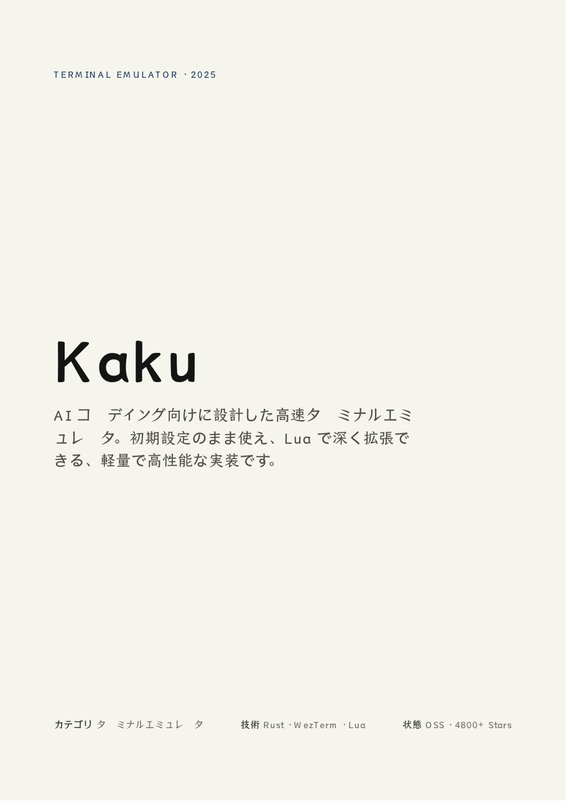 |  |
| **p2** 4.54 % 6.25 % >2/255 |  | 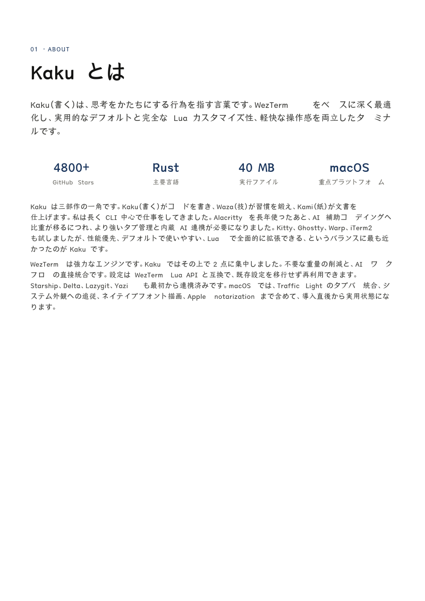 |  |
| **p3** 5.34 % 8.51 % >2/255 |  | 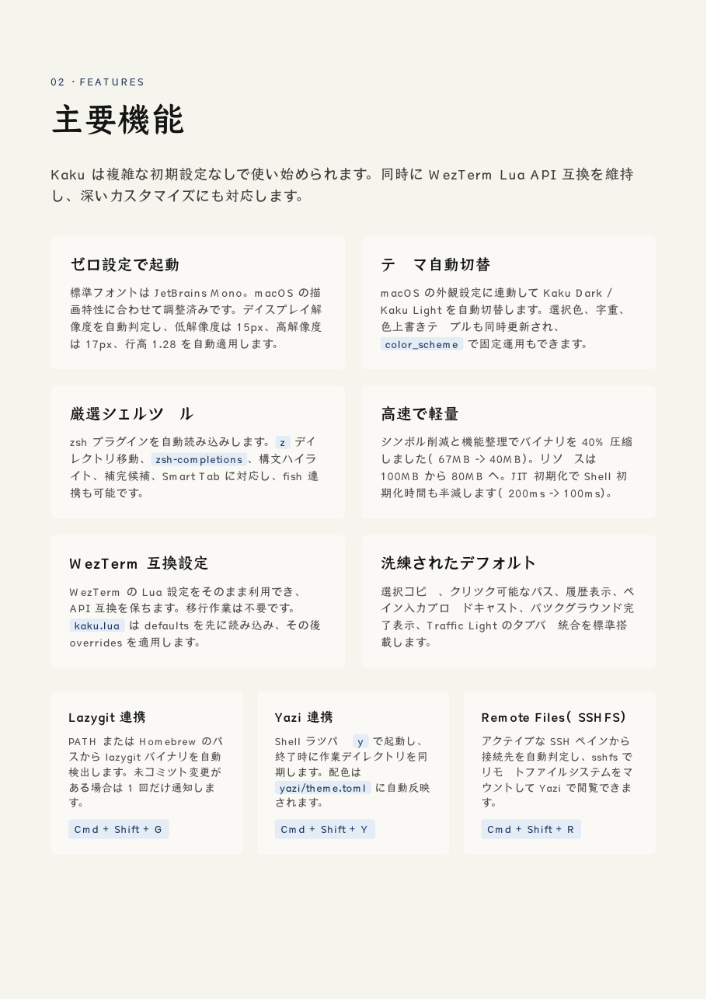 |  |
| **p4** 4.47 % 7.07 % >2/255 |  | 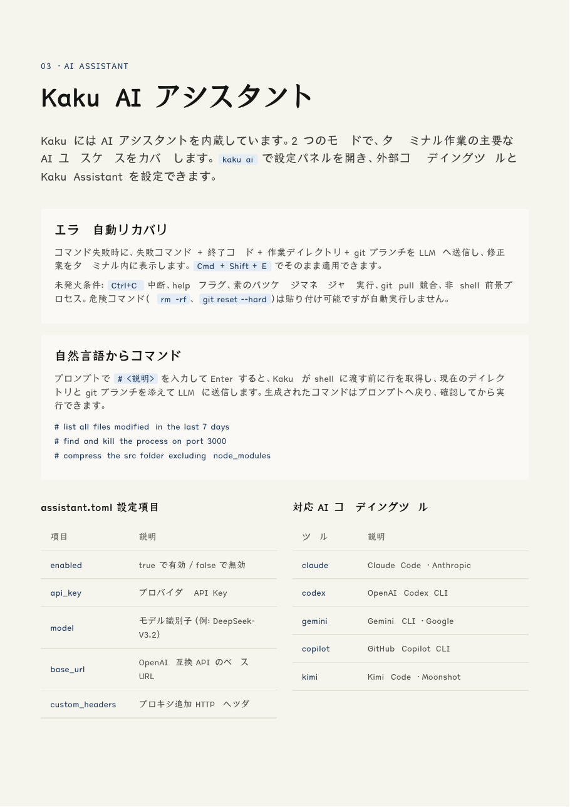 |  |
| **p5** 3.38 % 5.08 % >2/255 |  | 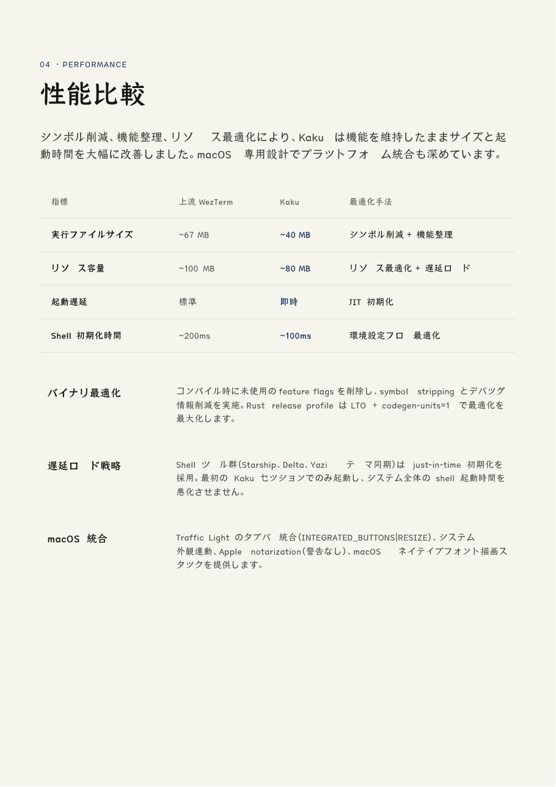 |  |
| **p6** 3.69 % 6.00 % >2/255 |  | 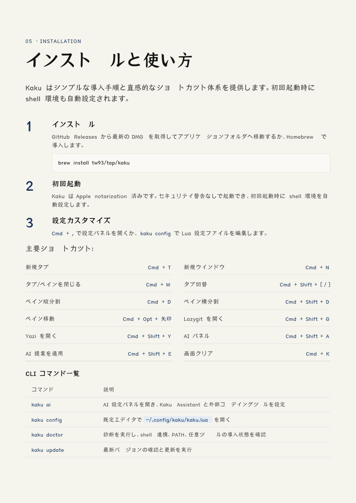 |  |
| **p7** 0.20 % 0.50 % >2/255 |  | 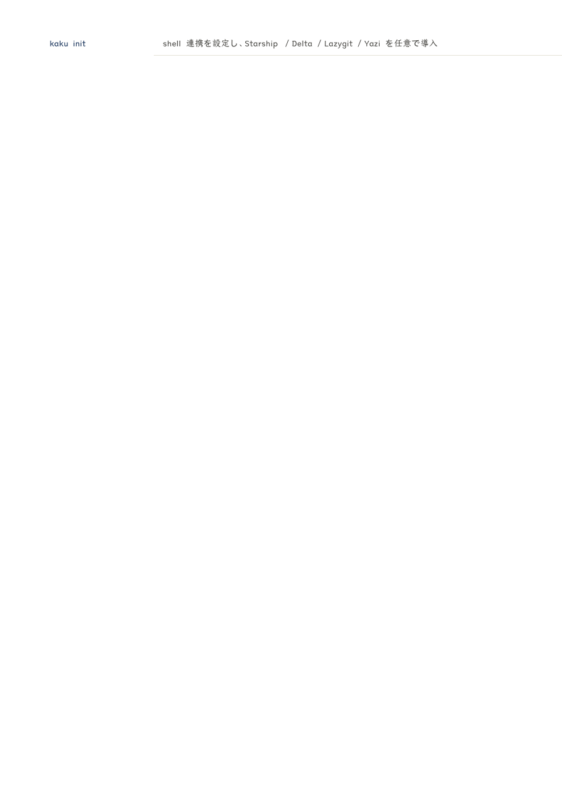 |  |
| **p8** 1.17 % 1.56 % >2/255 |  | 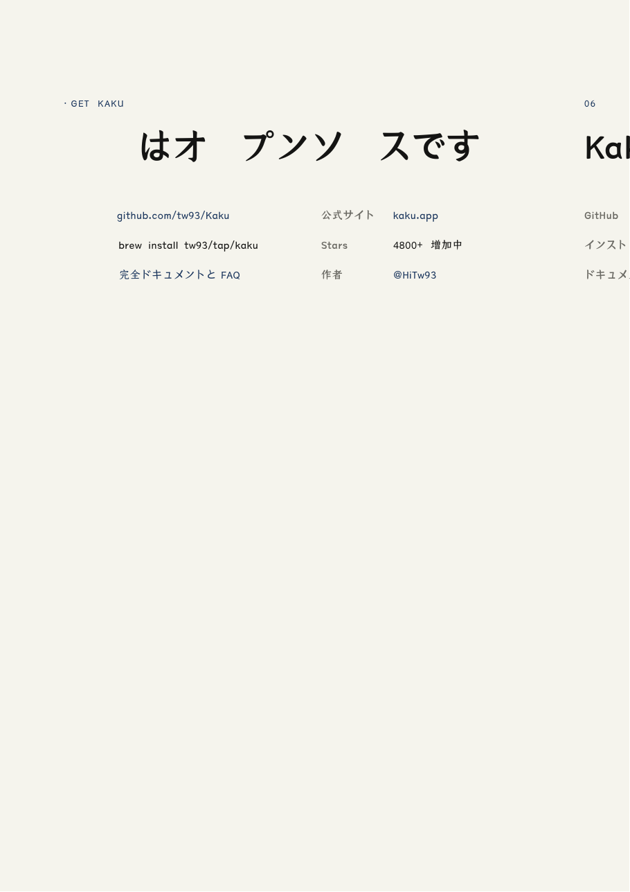 |  |

**Emitted:** backgrounds 28 · borders 69 · links 4 · canvasBackground 8 · clips 2

**Text extraction:** 0/8 pages character-exact (Chromium 3942 chars, Garri 3838)

Diagnostics

- `PDF_GLYPH_UNAVAILABLE` ×52 — No declared family in "YuMincho, "Yu Mincho", "Hiragino Mincho ProN", "Noto Serif CJK JP", "Source Han Serif JP", TsangerJinKai02, Georgia, serif" has a glyph for some of this text. Those characters are omitted rather than written as U+0000. Declare an @font-face covering this script. See detail.chars for which.
- `PDF_RESOURCE_INACCESSIBLE` — could not read image bytes for kaku-hero.jpg: The source image cannot be decoded.. The browser may still display it; a PDF needs the bytes.
- `PDF_RESOURCE_INACCESSIBLE` — could not read image bytes for kaku-action.jpg: The source image cannot be decoded.. The browser may still display it; a PDF needs the bytes.

---

## demo-kami-print

[Source HTML](https://github.com/tw93/Kami/blob/main/assets/demos/demo-kami-print.html) · [local copy](demos/demo-kami-print.html) · [Chromium PDF](out/demo-kami-print-chromium.pdf) · [Garri PDF](out/demo-kami-print-garri.pdf)

*Embeddable font forced on both sides:* [Chromium PDF](out/demo-kami-print-fair-chromium.pdf) · [Garri PDF](out/demo-kami-print-fair-garri.pdf) · [p1 diff](out/demo-kami-print-fair-p1-diff.png)

**Uses:** `@font-face` · `@page` · grid · flex · break-* · CJK

| | Chromium | Garri | Diff |
| --- | --- | --- | --- |
| **p1** 2.06 % 3.36 % >2/255 |  | 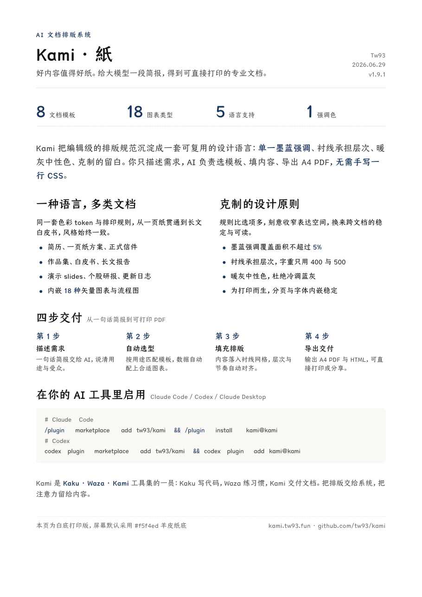 |  |

**Emitted:** backgrounds 1 · borders 3 · canvasBackground 1 · dashedSides 2

**Text extraction:** 1/1 pages character-exact (Chromium 790 chars, Garri 790)

---

## demo-letter

[Source HTML](https://github.com/tw93/Kami/blob/main/assets/demos/demo-letter.html) · [local copy](demos/demo-letter.html) · [Chromium PDF](out/demo-letter-chromium.pdf) · [Garri PDF](out/demo-letter-garri.pdf)

*Embeddable font forced on both sides:* [Chromium PDF](out/demo-letter-fair-chromium.pdf) · [Garri PDF](out/demo-letter-fair-garri.pdf) · [p1 diff](out/demo-letter-fair-p1-diff.png)

**Uses:** `@font-face` · `@page` · CJK

| | Chromium | Garri | Diff |
| --- | --- | --- | --- |
| **p1** 2.81 % 4.07 % >2/255 |  |  |  |

**Emitted:** borders 1 · links 1 · canvasBackground 1 · dashedSides 1

**Text extraction:** 1/1 pages character-exact (Chromium 437 chars, Garri 437)

---

## demo-mole

[Source HTML](https://github.com/tw93/Kami/blob/main/assets/demos/demo-mole.html) · [local copy](demos/demo-mole.html) · [Chromium PDF](out/demo-mole-chromium.pdf) · [Garri PDF](out/demo-mole-garri.pdf)

*Embeddable font forced on both sides:* [Chromium PDF](out/demo-mole-fair-chromium.pdf) · [Garri PDF](out/demo-mole-fair-garri.pdf) · [p1 diff](out/demo-mole-fair-p1-diff.png)

**Uses:** `@font-face` · `@page` · images · `box-shadow` · grid · flex · break-*

| | Chromium | Garri | Diff |
| --- | --- | --- | --- |
| **p1** 4.12 % 9.81 % >2/255 |  | 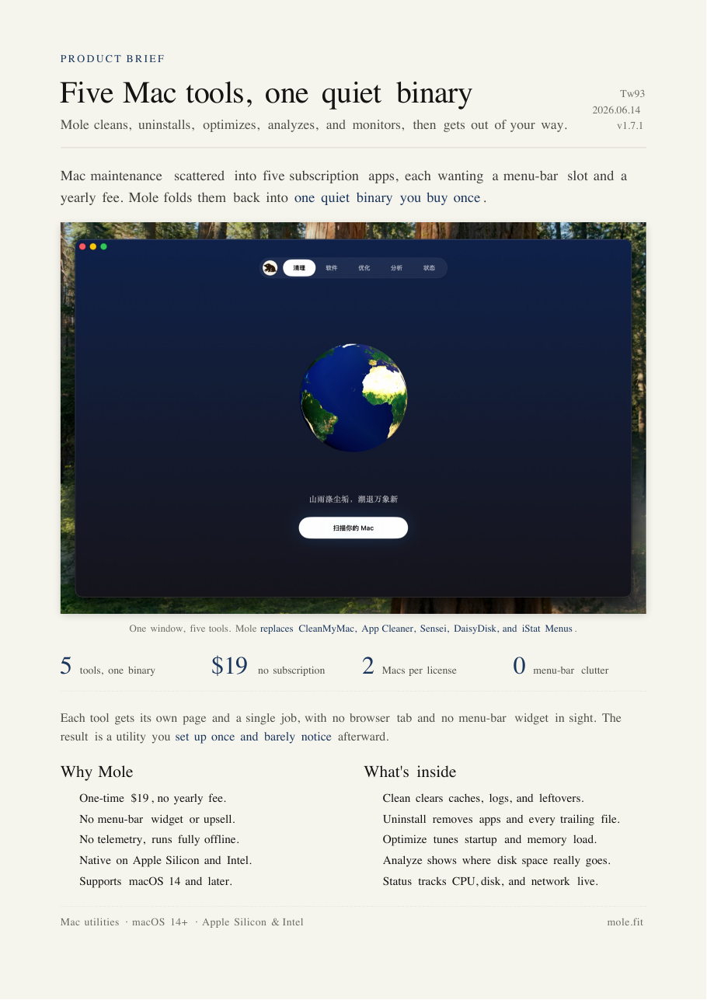 |  |

**Emitted:** borders 3 · images 1 · shadows 1 · canvasBackground 1 · clips 1 · dashedSides 2

**Text extraction:** 1/1 pages character-exact (Chromium 931 chars, Garri 931)

Diagnostics

- `PDF_FONT_FORMAT_UNEMBEDDABLE` — "jetbrains mono" is a WOFF2 whose glyph outlines are stored in WOFF2's transformed form, which cannot be turned back into an embeddable font here. A standard font is substituted so the text stays visible. Serve this family as TTF or OTF — or add one to the @font-face `src` list — to embed the real glyphs.
- `PDF_FONT_SUBSTITUTED` ×17 — no embeddable bytes for "Charter, Georgia, Palatino, "Times New Roman", serif" 500 normal — substituted the standard font Times-Roman. Word positions still come from the browser's own measurements; only glyph shapes differ. Declare an @font-face to embed the real font.
- `PDF_FONT_SUBSTITUTED` ×29 — no embeddable bytes for "Charter, Georgia, Palatino, "Times New Roman", serif" 400 normal — substituted the standard font Times-Roman. Word positions still come from the browser's own measurements; only glyph shapes differ. Declare an @font-face to embed the real font.

---

## demo-musk-resume

[Source HTML](https://github.com/tw93/Kami/blob/main/assets/demos/demo-musk-resume.html) · [local copy](demos/demo-musk-resume.html) · [Chromium PDF](out/demo-musk-resume-chromium.pdf) · [Garri PDF](out/demo-musk-resume-garri.pdf)

*Embeddable font forced on both sides:* [Chromium PDF](out/demo-musk-resume-fair-chromium.pdf) · [Garri PDF](out/demo-musk-resume-fair-garri.pdf) · [p1 diff](out/demo-musk-resume-fair-p1-diff.png) · [p2 diff](out/demo-musk-resume-fair-p2-diff.png)

**Uses:** `@font-face` · `@page` · grid · flex · break-*

| | Chromium | Garri | Diff |
| --- | --- | --- | --- |
| **p1** 8.01 % 11.50 % >2/255 |  |  |  |
| **p2** 5.98 % 9.22 % >2/255 |  |  |  |

**Emitted:** backgrounds 5 · borders 18 · links 7 · canvasBackground 2 · dashedSides 10

**Text extraction:** 2/2 pages character-exact (Chromium 4766 chars, Garri 4766)

Diagnostics

- `PDF_FONT_SUBSTITUTED` ×76 — no embeddable bytes for "Charter, Georgia, Palatino, "Times New Roman", serif" 500 normal — substituted the standard font Times-Roman. Word positions still come from the browser's own measurements; only glyph shapes differ. Declare an @font-face to embed the real font.
- `PDF_FONT_SUBSTITUTED` ×116 — no embeddable bytes for "Charter, Georgia, Palatino, "Times New Roman", serif" 400 normal — substituted the standard font Times-Roman. Word positions still come from the browser's own measurements; only glyph shapes differ. Declare an @font-face to embed the real font.

---

## demo-resume-ko

[Source HTML](https://github.com/tw93/Kami/blob/main/assets/demos/demo-resume-ko.html) · [local copy](demos/demo-resume-ko.html) · [Chromium PDF](out/demo-resume-ko-chromium.pdf) · [Garri PDF](out/demo-resume-ko-garri.pdf)

*Embeddable font forced on both sides:* [Chromium PDF](out/demo-resume-ko-fair-chromium.pdf) · [Garri PDF](out/demo-resume-ko-fair-garri.pdf) · [p1 diff](out/demo-resume-ko-fair-p1-diff.png) · [p2 diff](out/demo-resume-ko-fair-p2-diff.png)

**Uses:** `@font-face` · `@page` · grid · flex · break-* · CJK

| | Chromium | Garri | Diff |
| --- | --- | --- | --- |
| **p1** 5.25 % 10.05 % >2/255 |  | 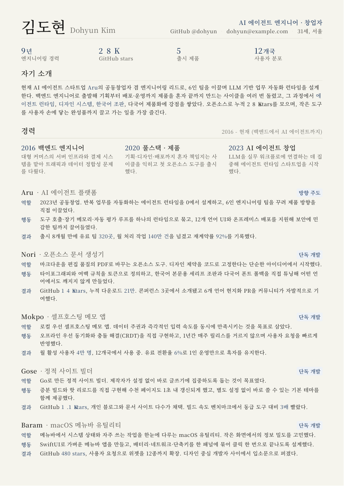 |  |
| **p2** 3.27 % 7.29 % >2/255 |  | 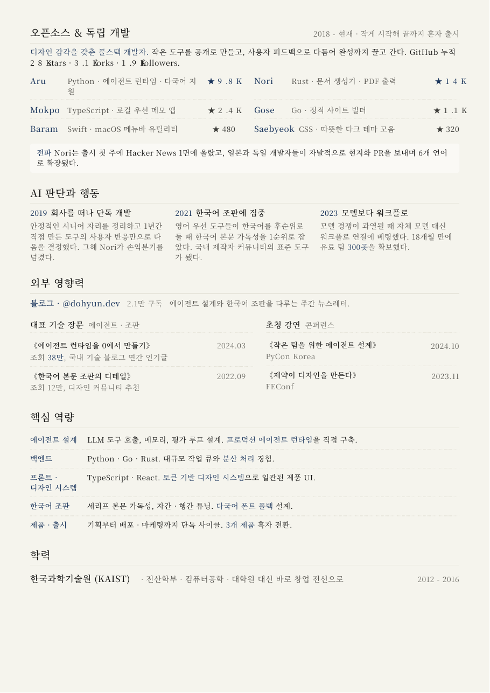 |  |

**Emitted:** backgrounds 6 · borders 20 · links 11 · canvasBackground 2 · dashedSides 12

**Text extraction:** 0/2 pages character-exact (Chromium 2351 chars, Garri 2351)

Diagnostics

- `PDF_FONT_NOT_SUBSET` — "source han serif k" has OpenType/CFF outlines, whose subsetter produces a font that draws nothing, so the whole face is embedded. The PDF is much larger than it needs to be — 7588 KB for this face. Supply a TrueType-outline (TTF) version, or a CFF font already cut down to the glyphs you need.
- `PDF_FONT_NOT_SUBSET` — "source han serif k" has OpenType/CFF outlines, whose subsetter produces a font that draws nothing, so the whole face is embedded. The PDF is much larger than it needs to be — 7490 KB for this face. Supply a TrueType-outline (TTF) version, or a CFF font already cut down to the glyphs you need.

---

## demo-tesla

[Source HTML](https://github.com/tw93/Kami/blob/main/assets/demos/demo-tesla.html) · [local copy](demos/demo-tesla.html) · [Chromium PDF](out/demo-tesla-chromium.pdf) · [Garri PDF](out/demo-tesla-garri.pdf)

*Embeddable font forced on both sides:* [Chromium PDF](out/demo-tesla-fair-chromium.pdf) · [Garri PDF](out/demo-tesla-fair-garri.pdf) · [p1 diff](out/demo-tesla-fair-p1-diff.png) · [p2 diff](out/demo-tesla-fair-p2-diff.png)

**Uses:** `@font-face` · `@page` · SVG · grid · flex · tables · break-* · counters · CJK

| | Chromium | Garri | Diff |
| --- | --- | --- | --- |
| **p1** 2.02 % 4.30 % >2/255 |  |  |  |
| **p2** 3.37 % 6.26 % >2/255 |  |  |  |

**Emitted:** backgrounds 6 · borders 65 · svg 53 · canvasBackground 2 · clips 40 · dashedSides 3

**Text extraction:** 1/2 pages character-exact (Chromium 1993 chars, Garri 2022)

Diagnostics

- `PDF_FONT_SUBSTITUTED` ×16 — no embeddable bytes for "Charter, Georgia, serif" 400 normal — substituted the standard font Times-Roman. Word positions still come from the browser's own measurements; only glyph shapes differ. Declare an @font-face to embed the real font.
- `PDF_FONT_SUBSTITUTED` — no embeddable bytes for "Charter, Georgia, serif" 500 normal — substituted the standard font Times-Roman. Word positions still come from the browser's own measurements; only glyph shapes differ. Declare an @font-face to embed the real font.

---

## demo-waza

[Source HTML](https://github.com/tw93/Kami/blob/main/assets/demos/demo-waza.html) · [local copy](demos/demo-waza.html) · [Chromium PDF](out/demo-waza-chromium.pdf) · [Garri PDF](out/demo-waza-garri.pdf)

*Embeddable font forced on both sides:* [Chromium PDF](out/demo-waza-fair-chromium.pdf) · [Garri PDF](out/demo-waza-fair-garri.pdf) · [p1 diff](out/demo-waza-fair-p1-diff.png)

**Uses:** `@font-face` · `@page` · SVG · images · `box-shadow` · grid · flex · break-* · CJK

| | Chromium | Garri | Diff |
| --- | --- | --- | --- |
| **p1** 5.71 % 8.09 % >2/255 |  | 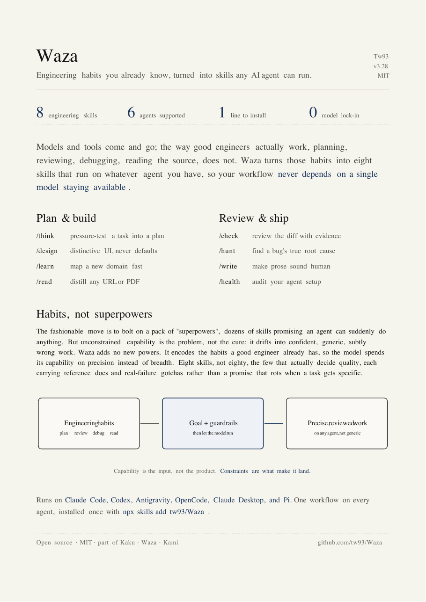 |  |

**Emitted:** borders 3 · svg 5 · canvasBackground 1 · clips 12 · dashedSides 2

**Text extraction:** 0/1 pages character-exact (Chromium 1505 chars, Garri 1504)

Diagnostics

- `PDF_FONT_FORMAT_UNEMBEDDABLE` ×2 — "jetbrains mono" is a WOFF2 whose glyph outlines are stored in WOFF2's transformed form, which cannot be turned back into an embeddable font here. A standard font is substituted so the text stays visible. Serve this family as TTF or OTF — or add one to the @font-face `src` list — to embed the real glyphs.
- `PDF_FONT_SUBSTITUTED` ×14 — no embeddable bytes for "Charter, Georgia, Palatino, "Times New Roman", serif" 500 normal — substituted the standard font Times-Roman. Word positions still come from the browser's own measurements; only glyph shapes differ. Declare an @font-face to embed the real font.
- `PDF_TEXT_NOT_ENCODABLE` — "Charter, Georgia, Palatino, "Times New Roman", serif" had no embeddable bytes, and the substituted standard font is WinAnsi-only, so some characters are omitted. Declare an @font-face covering this script. See detail.chars for which.
- `PDF_FONT_SUBSTITUTED` ×32 — no embeddable bytes for "Charter, Georgia, Palatino, "Times New Roman", serif" 400 normal — substituted the standard font Times-Roman. Word positions still come from the browser's own measurements; only glyph shapes differ. Declare an @font-face to embed the real font.
- `PDF_FONT_SUBSTITUTED` ×8 — no embeddable bytes for "Charter, Georgia, Palatino, "Times New Roman", serif" 700 normal — substituted the standard font Times-Bold. Word positions still come from the browser's own measurements; only glyph shapes differ. Declare an @font-face to embed the real font.
- `PDF_FONT_SUBSTITUTED` ×3 — no embeddable bytes for ""JetBrains Mono", monospace" 400 normal — substituted the standard font Courier. Word positions still come from the browser's own measurements; only glyph shapes differ. Declare an @font-face to embed the real font.
- `PDF_FONT_SUBSTITUTED` ×3 — no embeddable bytes for "TsangerJinKai02, "Source Han Serif SC", "Songti SC", Charter, Georgia, serif" 500 normal — substituted the standard font Times-Roman. Word positions still come from the browser's own measurements; only glyph shapes differ. Declare an @font-face to embed the real font.
- `PDF_FONT_SUBSTITUTED` ×3 — no embeddable bytes for "TsangerJinKai02, "Source Han Serif SC", "Songti SC", Charter, Georgia, serif" 400 normal — substituted the standard font Times-Roman. Word positions still come from the browser's own measurements; only glyph shapes differ. Declare an @font-face to embed the real font.

---
